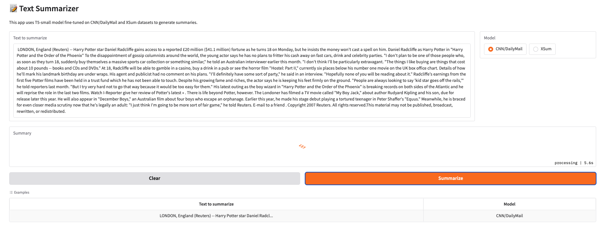

# 🤖 Text Summarizer

[](https://python.org)
[](https://pytorch.org)
[](https://huggingface.co)
[](https://python-poetry.org)
[](https://gradio.app)

Simple text summarizer using T5-small model, trained on CNN/DailyMail and XSum datasets.



## 🚀 Quick Start

```bash
# Install dependencies
poetry install

# Run the web interface
poetry run python -m src.app.app

# Or train models from scratch
poetry run python -m src.main
```

## 📊 Results

### CNN/DailyMail (5 epochs)

- **ROUGE-1**: 30.5%
- **ROUGE-2**: 12.5%
- **ROUGE-L**: 22.7%

### XSum (5 epochs)

- **ROUGE-1**: 29.5%
- **ROUGE-2**: 9.1%
- **ROUGE-L**: 23.3%

## 🌟 Features

- ✅ **Two Models**: CNN/DailyMail (detailed) and XSum (concise)
- ✅ **Web Interface**: Easy-to-use Gradio UI
- ✅ **Apple Silicon**: Native MPS support
- ✅ **Clean Code**: Simple and maintainable

## 📊 Learning Curves

### XSum Progress


### CNN/DailyMail Progress


## 🎯 Example Outputs

### XSum Example

**Input:** The full cost of damage in Newton Stewart, one of the areas worst affected, is still being assessed. Repair work is ongoing in Hawick and many roads in Peeblesshire remain badly affected by standing water...

**Reference:** Clean-up operations are continuing across the Scottish Borders and Dumfries and Galloway after flooding caused by Storm Frank.

**Model:** A flood warning has been put in place across the Scottish Borders due to flooding in Dumfries and Galloway.

### CNN/DailyMail Example

**Input:** LONDON, England (Reuters) -- Harry Potter star Daniel Radcliffe gains access to a reported £20 million ($41.1 million) fortune as he turns 18 on Monday, but he insists the money won't cast a spell on him...

**Reference:** Harry Potter star Daniel Radcliffe gets £20M fortune as he turns 18 Monday . Young actor says he has no plans to fritter his cash away . Radcliffe's earnings from first five Potter films have been held in trust fund .

**Model:** Daniel Radcliffe says he has no plans to fritter his cash away on fast cars, drink and celebrity parties. At 18, he will be able to gamble in a casino, buy a drink in a pub or see the horror film "Hostel: Part II" Radcliffe's earnings from the first five Potter films have been held in a trust fund.

## 📁 Project Structure

```
Summarizer/
├── 📄 README.md
├── 📄 pyproject.toml        # Dependencies
└── src/
    ├── 🧠 model/model.py    # T5 Model
    ├── 📊 data/dataio.py    # Data Loading
    ├── 🏋️ train/train.py    # Training Loop
    ├── 📈 utils/utils.py    # ROUGE Metrics
    ├── 🧪 test.py           # Model Testing
    └── 🚀 main.py           # Entry Point
```

## 🛠️ Installation

### Prerequisites

- Python 3.9+
- Poetry

### Setup

```bash
git clone https://github.com/00200200/t5-text-summarization-cnn-dailymail

cd summarizer
poetry install
```

## 🎯 Quick Start

```bash
# Train on single dataset
poetry run python -m src.main xsum

# Train on both datasets
poetry run python -m src.main

# Test trained models
poetry run python -m src.test
```

## 🔧 Model Configuration

- **Base Model**: T5-small (60M params)
- **Max Input Length**: 512 tokens
- **Max Output Length**: 128/150 tokens
- **Learning Rate**: 2e-4
- **Optimizer**: AdamW
- **Device**: MPS/CPU
- **Total Code**: 156 lines
- **Default Epochs**: 5

## 📊 Training Details

- **Training Size**: 30,000 samples per dataset
- **Validation Size**: 1,000 samples per dataset
- **Batch Size**: 16
- **Scheduler**: Linear with warmup
- **Evaluation**: After each epoch

## 🌐 Web Interface

The project includes a user-friendly web interface built with Gradio that allows you to:

- Choose between CNN/DailyMail and XSum models
- Input any text and get instant summaries
- Compare different model outputs

### Running the Interface

```bash
poetry run python -m src.app.app
```

This will start a local server at http://127.0.0.1:7861 where you can access the web interface.

### Features

- 📝 Text input with comfortable editing area
- 🔄 Model selection (CNN/DailyMail or XSum)
- 📊 Pre-loaded examples
- 🧹 Clear button for convenience
- 💫 Instant summarization

### Models

- **CNN/DailyMail**: Generates longer, more detailed summaries
- **XSum**: Creates short, one-sentence summaries
